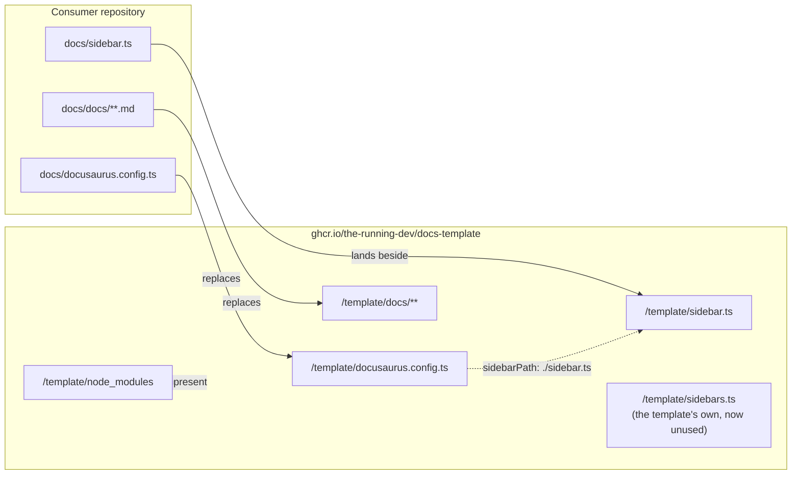
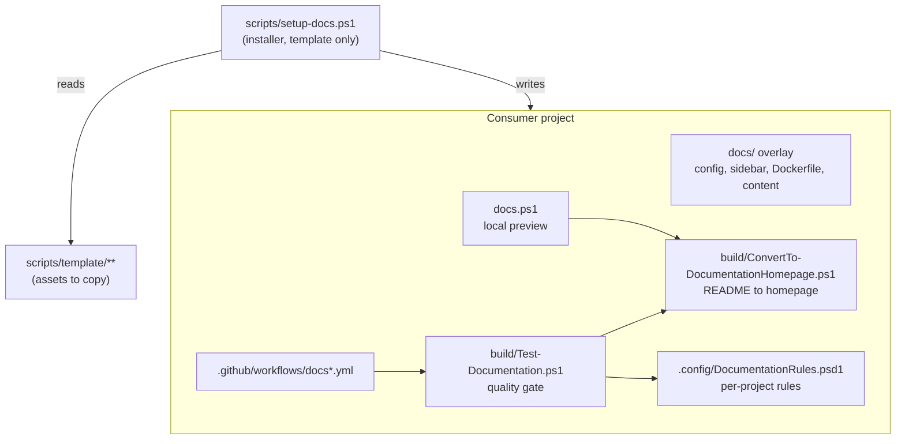
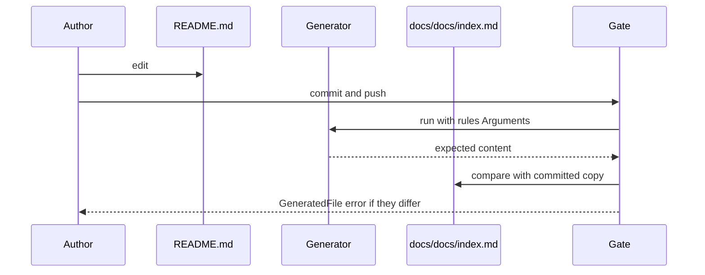
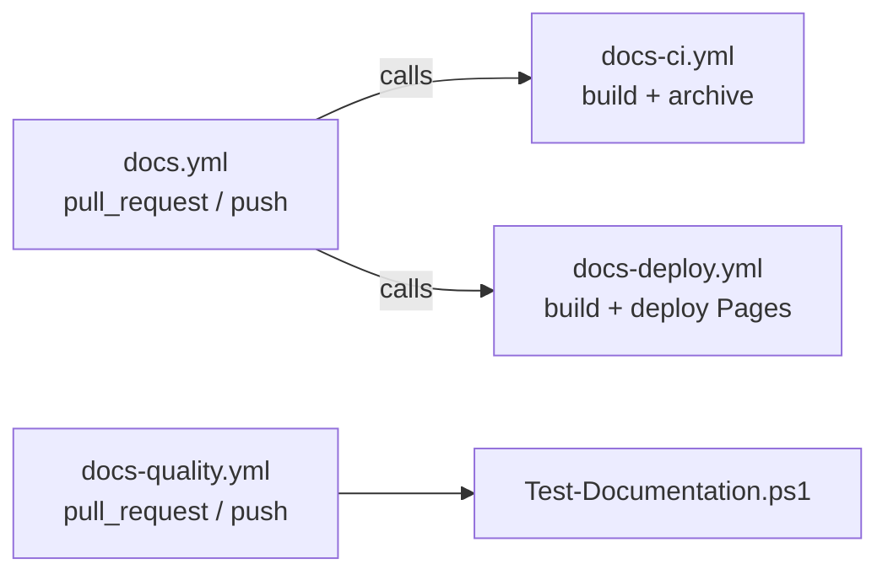

The documentation system is what a consuming project installs to author, preview,
check, and publish its own documentation from this template. One command —
`scripts/setup-docs.ps1` — writes the overlay, a local preview entry point, a
documentation quality gate, and the workflows that run them.

This page describes how it is implemented and why it is shaped the way it is. For
how to run the scripts, see [Automation](../configuration/automation-scripts.md).

## The problem it solves

A project that wants documentation from this template needs more than Markdown. It
needs a site configuration, a way to preview locally without installing Node, a
check that its links and generated files stay correct, and CI that verifies and
deploys. Assembled by hand, each project rediscovers the same decisions and makes
the same mistakes.

The system installs all of it, and — because the installed files stay
byte-identical to the template — a project can re-run the installer later to pick
up upstream fixes.

## Two layouts, and why they differ

The single most important thing to understand is that **the template and a
consumer use different directory shapes**.

|                    | Template (this repository)         | Consumer project            |
| ------------------ | ---------------------------------- | --------------------------- |
| Site configuration | `docusaurus.config.ts` at the root | `docs/docusaurus.config.ts` |
| Sidebar            | `sidebars.ts` at the root          | `docs/sidebar.ts`           |
| Authored Markdown  | `docs/**`                          | `docs/docs/**`              |

A consumer's `docs/` is not a content directory — it is a **self-contained
overlay** that gets copied over `/template` inside the published base image. That
is why it carries its own config, its own sidebar, and a nested `docs/` for the
actual pages.

The overlay is a plain recursive file copy performed by `scripts/docs-build.ps1`,
which runs **inside** the image. Because it copies every file over the template
root preserving relative paths, a consumer can override anything — not only
Markdown, but `config/**`, `src/**`, and the Docusaurus config itself.

The sidebar is the one piece that is not a replacement, and it is worth
understanding why. The template's own sidebar is `sidebars.ts`; a consumer's is
`sidebar.ts`. Different names, so the overlay does not overwrite anything — the
consumer's file simply lands beside the template's, which stays on disk and stops
mattering.

What actually redirects the site is the overlaid config: the template's root
config sets `sidebarPath: './sidebars.ts'`, and the consumer's sets
`sidebarPath: './sidebar.ts'`. A consumer that supplied a sidebar without also
overlaying the config would see no effect at all, because nothing would point at
the file it added.

## Components

### `scripts/setup-docs.ps1`

The installer. Lives only in the template and is never copied into a project. It
resolves the target directory, validates `-ScriptDir` and `-ConfigDir`, copies
each asset from `scripts/template/`, rewrites paths inside the copies when those
directories are non-default, and prints a created/replaced/skipped summary.

It supports `-WhatIf` throughout, so a project can see every file that would be
written before anything is.

### `scripts/template/**`

The assets to install. These are inert in the template — nothing here runs as part
of this site's own build. They exist to be copied.

| Asset                                 | Installed as         | Purpose                     |
| ------------------------------------- | -------------------- | --------------------------- |
| `docusaurus.config.ts`, `sidebar.ts`  | `docs/`              | Site configuration seeds    |
| `Dockerfile`, `dockerignore`          | `docs/`              | Local preview overlay image |
| `docs.ps1`                            | project root         | Preview entry point         |
| `ConvertTo-DocumentationHomepage.ps1` | `<ScriptDir>/`       | README to homepage          |
| `Test-Documentation.ps1`              | `<ScriptDir>/`       | Quality gate                |
| `DocumentationRules.psd1`             | `<ConfigDir>/`       | Per-project gate rules      |
| `docs.yml`, `docs-quality.yml`        | `.github/workflows/` | Triggers and gate           |
| `docs-ci.yml`, `docs-deploy.yml`      | `.github/workflows/` | Verify and deploy           |

`dockerignore` is stored without its leading dot so it is neither hidden in the
template nor applied to the template's own build context.

`docs-ci.yml` and `docs-deploy.yml` are not copied by the installer directly. It
delegates to `scripts/setup-docs-workflow.ps1`, which already owned that job and
reports those two files itself — which is why the installer's summary notes them
separately rather than counting them.

### Per-project rules

`DocumentationRules.psd1` is the one installed file a project is expected to
edit. It carries the terminology rules, the path segments and files to skip, and
the `GeneratedFiles` entries the drift check reads.

The shipped defaults are deliberately **generic** — product names any project
would want spelled consistently, such as `GitHub`, `PowerShell`, `TypeScript`,
`Docusaurus`, and `macOS`. They are a starting point, not a policy. The rule that
usually earns its keep is the one a project adds: its own product name and the
misspellings it keeps attracting.

### The homepage generator

`ConvertTo-DocumentationHomepage.ps1` returns what `docs/docs/index.md` should
contain: Docusaurus front matter followed by the README, with the configured site
origin rewritten to `/`.

That rewrite is the point. The README is rendered twice — on the code host, where
links must be absolute to work, and as the site homepage, where those same
absolute links would send a reader back out to the site they are already on.
Writing absolute links and rewriting them here keeps one file correct in both
places.

Three callers share this one implementation: the installer when first generating
the homepage, the preview script on every run, and the gate's drift check. A
second implementation would be free to disagree with the first, which is exactly
the failure the drift check exists to catch.

### The quality gate

`Test-Documentation.ps1` validates authored Markdown that the site build never
sees. Docusaurus already fails on unresolved links inside `docs/`, so the gate
covers the rest: root files such as `README.md`, and cross-file relative links and
heading anchors everywhere.

| Rule             | Severity | Checks                                               |
| ---------------- | -------- | ---------------------------------------------------- |
| `MarkdownLink`   | Error    | Relative link targets exist on disk                  |
| `MarkdownAnchor` | Error    | `#fragment` matches a heading in the target document |
| `GeneratedFile`  | Error    | A generated file still matches its source            |
| `Terminology`    | Warning  | Product names keep consistent casing                 |

Errors fail the run. Warnings are reported without blocking, unless
`-TreatWarningsAsErrors` is passed. Any severity other than `Warning` blocks, so a
rule added later with a new or mistyped severity fails loudly rather than passing
silently.

Two implementation details matter:

**Code is masked before rules run.** Fenced blocks, inline spans, link targets,
and bare URLs are blanked with line and column numbers preserved, so an example
that deliberately shows the wrong spelling is not a finding and the reported
position still points at the right place.

**The repository root is found by walking up for `.git`.** The gate can be
installed at any depth via `-ScriptDir`, so the root cannot be assumed one level
above the script. A project that is not a git repository gets a clear error
instead of a silently wrong root.

### The drift check

`GeneratedFiles` in the rules file names a generated file, its source, and the
script that produces it. The gate re-runs that generator and compares the result
to the committed copy.

This is what keeps one README working both on the code host and as the site
homepage: the homepage cannot silently fall behind, because CI regenerates it and
fails when the committed copy no longer matches.

Running `./docs.ps1` regenerates the homepage as a side effect, so the normal
preview loop keeps it current without anyone remembering to.

## Workflows

Four files, with one carrying the triggers.

`docs-ci.yml` and `docs-deploy.yml` declare only `workflow_call` and
`workflow_dispatch` — they can be invoked or run by hand, but nothing triggers
them automatically. `docs.yml` supplies the triggers and calls them, with
`secrets: inherit` so the registry token reaches the called workflow and
`permissions` covering the superset the deploy needs. Keeping the triggers in a
separate file is what lets the other two stay byte-identical to the template.

`docs-quality.yml` is its own workflow rather than a job appended to an existing
test workflow, because the installer only writes files it owns. Appending a job
would mean editing a file the project author wrote, and would make reinstalling
upstream fixes unsafe.

`docs-ci.yml` also runs the same artifact-archiving step the deploy uses. Without
it, archiving first runs after merge, where a failure blocks nothing — which is
how a green pull request could be followed by a broken deploy seconds later.

## Local preview

`docs.ps1` regenerates the homepage, builds an image that overlays `docs/` onto
the published base image, and runs it. No Node install and no template checkout are
needed locally — the base image already carries the template with dependencies
installed.

`-Live` bind-mounts `docs/` over the running container so edits hot-reload;
`-BuildOnly` stops after the build.

The preview `Dockerfile` removes the template's own `docs` and `src/pages` before
overlaying, so a consumer sees its own content rather than the template's. It
deliberately keeps `src/theme/NotFound`: the template's 404 links only to routes it
is given, so it is safe anywhere, and CI's overlay does not delete it — stripping
it locally would make preview differ from the published site.

## Design decisions

**Only write files the installer owns.** The gate ships as its own workflow, and
no installed file is ever edited in place. This is what makes re-running the
installer safe, and it is why the summary distinguishes created from skipped.

**Idempotent by default.** An existing file is left alone and reported as skipped
unless `-Overwrite` is given. The workflows are kept byte-identical to the
template precisely so a re-run can pick up upstream fixes.

**Default to safe, not to convenient.** Anything a downstream site inherits
defaults to the option that works everywhere. The shared 404, for example, emits
no route beyond `/` unless a site supplies more, because only `/` is guaranteed to
resolve on every consumer.

**Paths are parameters, not conventions.** Not every project has a `build/` or a
`.config/`, so `-ScriptDir` and `-ConfigDir` are parameters. Both are validated to
stay inside the project: a rooted path or a `..` segment is rejected, and the
resolved path is re-checked for containment.

**Front matter values are escaped, not interpolated.** Title and description are
emitted as single-quoted YAML scalars with newlines collapsed. A raw newline in a
title would otherwise close the front matter block early and let arbitrary keys be
injected into the generated page.

## Verifying a change to the system

Changes here are hard to test from inside the template, because the template is
not shaped like a consumer. Verify against a throwaway repository instead — an
empty directory with `git init` and a README is enough. The gate needs the `.git`
marker to find the repository root.

- Install into it and confirm every expected artifact lands.
- Run again with no switches: nothing should change, and the summary should say
  what it skipped.
- Run with `-Overwrite`: files are replaced, and the gate still passes — which
  shows the install is self-consistent rather than merely quiet.
- Run with `-WhatIf`: every action is reported and no file is written.
- `./docs.ps1 -BuildOnly` builds, and the site compiles with no broken links.
- `./build/Test-Documentation.ps1` passes on the scaffolded content.
- Break each rule on purpose and confirm it fires: a dangling relative link, a
  bad same-document anchor, a bad cross-document anchor, a terminology
  violation, and a README edited without regenerating the homepage.
- Run with `-NoHomepage`: no `GeneratedFiles` entry, no generator installed, and
  no drift finding for a file this project does not generate.
- Run with a non-default `-ScriptDir` and `-ConfigDir` and confirm the gate still
  runs from the relocated paths.

A regression test is only worth having if it fails without the fix. When adding
one, revert the fix and confirm the test goes red before keeping it.

## Constraints worth knowing

- **A consumer's README should use absolute links** for anything the homepage
  needs to reach. The generator rewrites the site origin but not relative links,
  so a repository-relative link that is valid at the root breaks once copied a
  directory deeper into `docs/docs/index.md`.
- **The base image needs GNU tar.** `upload-pages-artifact` archives with
  `tar --hard-dereference`, which Alpine's BusyBox tar rejects. The image installs
  GNU tar for this reason.
- **A `generated-index` category needs an explicit `slug`.** It defaults to
  `/category/<name>`, so a link to the bare path 404s until the slug is set. Only
  the site build catches this.
- **`trailingSlash: false` means `/next/` 404s while `/next` works.** Do not write
  trailing slashes in links.
- **GHCR packages are private by default.** A documented `docker pull` fails for
  everyone but the owner until visibility is changed.
- **Docusaurus versioning is deliberately not used.** With a single version, a
  snapshot is a second copy to keep in step, and re-cutting one requires
  temporarily removing `lastVersion` because Docusaurus refuses to load a config
  naming a version that `versions.json` does not list.
